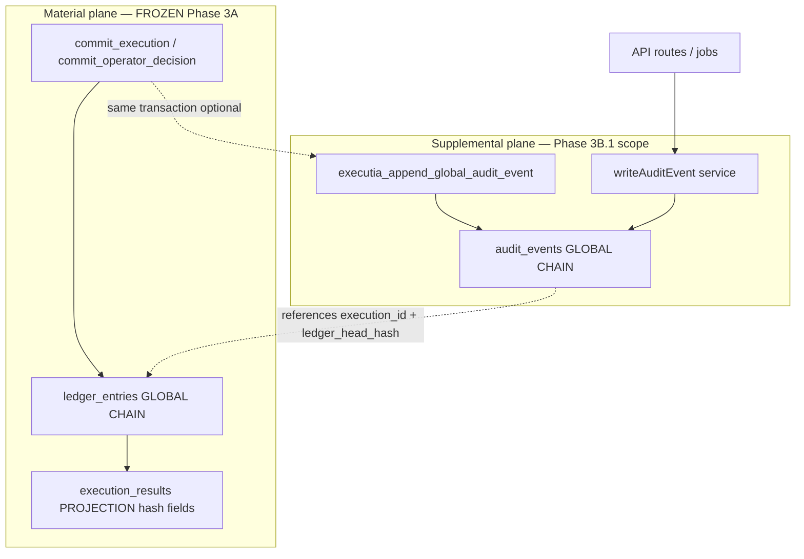
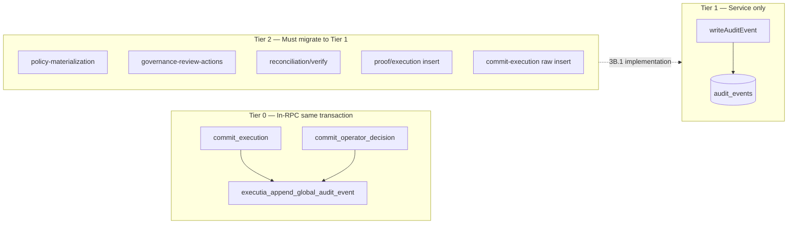

# EXECUTIA Phase 3B.1 — Supplemental Audit Layer Boundary

**Document class:** Architecture / governance boundary specification  
**Approval:** Planning only — Phase 3B.1  
**Prerequisite:** Phase 3A stabilization (`LEDGER_ENTRIES_PRIMARY`, `executia/ledger/v1`)  
**Status:** No code · No SQL · No commits · No implementation  

**Parent plan:** `docs/PHASE_3B_INSTITUTIONAL_SEMANTICS_PLAN.md` (§3B.1 subset formalized here)

---

## 1. Purpose

Phase 3B.1 defines the **supplemental audit layer** only: a single **global, append-only, hashed** `audit_events` chain that records institutional narrative, observation, and external attachment — without altering material execution truth, operator RPC semantics, execution statuses, or public proof contracts.

Material execution truth remains exclusively:

```text
ledger_entries  →  executia/ledger/v1  →  LEDGER_ENTRIES_PRIMARY
```

Supplemental audit **observes, explains, and binds** to material truth; it **never replaces** it.

---

## 2. Architecture boundary

### 2.1 Two-plane model



| Plane | Store | Authority | Phase 3B.1 |
|-------|-------|-----------|------------|
| **Material** | `ledger_entries` | `ledger.js` + SQL `executia_ledger_*` | **Out of scope — frozen** |
| **Supplemental** | `audit_events` | `audit.js` + SQL `executia_append_global_audit_event` | **In scope — definition only** |
| **Settlement observation** | `core_ledger` | `core-ledger.js` | Out of scope (observe via audit only) |
| **Public proof** | Registry / receipt JSON | `public-proof-registry.js` | **Schema frozen — attach via existing event types** |

### 2.2 Boundary invariants

| ID | Invariant |
|----|-----------|
| B1 | No supplemental audit row may be the **sole** source of `execution_results.status` or `ledger_entries` content |
| B2 | Supplemental audit hash chain is **global** (one predecessor sequence for the table), not per `execution_id` |
| B3 | All supplemental writes are **append-only**; corrections use new rows with `correction_of` / `supersedes_audit_id` |
| B4 | RPC material steps (ledger append + projection update) remain unchanged in authority and formula |
| B5 | `GET /api/v1/ledger-verify` top-level `verified` remains `ledger_chain.verified` only |
| B6 | Public proof consumers may **read** audit; proof schema and required event types unchanged |

### 2.3 What “supplemental” means

| Allowed in supplemental audit | Forbidden in supplemental audit |
|------------------------------|----------------------------------|
| Operator narrative (`OPERATOR_ACTION`, `OPERATOR_APPROVED`) | Declaring `status: COMMITTED` as authority |
| External provider confirmation received | Replacing `entry_hash` |
| Reconciliation observation outcome | Inventing ledger links not in `ledger_entries` |
| Policy / quorum collection events | Per-execution isolated hash chains |
| Commit narrative (`EXECUTION_SUBMITTED`, `OPERATOR_DECISION_RECORDED`) | Material duplicate of full status transition without `reference_only` flag |

**RPC rename direction (semantic only, not implementation):**

| Legacy RPC audit (pre-3B.1) | Target supplemental type | Payload rule |
|-----------------------------|--------------------------|--------------|
| `EXECUTION_CREATED` | `EXECUTION_SUBMITTED` | `reference_only: true`, includes `ledger_head_hash`, `status`, `decision` as **observation** |
| `OPERATOR_DECISION_COMMITTED` | `OPERATOR_DECISION_RECORDED` | Same; must not be used to infer status without reading ledger |

---

## 3. Supplemental audit schema direction

### 3.1 Design principles

- **Extend** `audit_events` in place; no parallel `audit_events_v2` table in 3B.1.
- **Hash columns required** for all rows after cutover (`chain_era >= 3B1`).
- **Payload** carries institutional semantics; **hash** carries integrity.
- **Organization scope** optional column (existing pattern); does not partition hash chain.

### 3.2 Column direction (logical model)

| Column / field | Role | Required post-cutover |
|--------------|------|------------------------|
| `id` | Surrogate key | Yes |
| `event_type` | Institutional event taxonomy | Yes |
| `execution_id` | Correlation (nullable for system events) | When execution-scoped |
| `actor` | Human / system / agent identity | Yes |
| `created_at` | Global ordering (tie-break: `id`) | Yes |
| `hash` | Supplemental chain fingerprint | Yes |
| `previous_hash` / `previous_event_hash` | Global predecessor | Yes |
| `payload` | JSON institutional body | Yes |
| `payload.reference_only` | Marks non-authoritative status copies | Yes when mirroring material |
| `payload.ledger_head_hash` | Bind to material head at event time | Recommended |
| `payload.chain_era` | `3B1` vs `LEGACY` | Yes |
| `payload.correction_of` | Prior audit `id` for amendments | Optional |
| `organization_id` | Tenant scope | Optional |

**Not in 3B.1 schema direction:** new tables for external proof (attachment lives in `payload.external_proof` v1).

### 3.3 Event type taxonomy (supplemental only)

| Category | Event types (direction) |
|----------|-------------------------|
| **Lifecycle observation** | `EXECUTION_SUBMITTED`, `OPERATOR_DECISION_RECORDED` |
| **Operator narrative** | `OPERATOR_ACTION`, `OPERATOR_APPROVED`, `OPERATOR_BLOCKED` |
| **Reconciliation observation** | `RECONCILIATION_OBSERVED`, `RECONCILIATION_VERIFY`, `RECONCILIATION_CLEARED` |
| **External attachment** | `EXTERNAL_PROVIDER_CONFIRMED`, `EXTERNAL_PROOF_ATTACHED`, `EXECUTION_TICKET_LINKED` |
| **Governance** | `OPERATOR_APPROVAL_COLLECTED`, `ESCALATION_RECORDED`, `QUORUM_SATISFIED`, `SYSTEM_HALT`, `HALT_LIFTED` |
| **Policy** | `POLICY_MATERIALIZED`, `POLICY_DECISION_RECORDED` |

**Frozen for public proof:** existing registry types (`OPERATOR_APPROVED`, `OPERATOR_BLOCKED`, `SETTLEMENT_RECONCILED`, truth anchor types) remain valid; 3B.1 may **emit** them via `writeAuditEvent` but must not **rename** registry contract types.

### 3.4 Hash formula direction

| Property | Rule |
|----------|------|
| Authority | `services/audit.js` — `buildAuditHash` |
| Input canonicalization | `stableStringify` field order documented in `audit.js` header |
| Predecessor | Global last `audit_events.hash` by `(created_at DESC, id DESC)` |
| SQL parity | Future `executia_audit_event_hash(jsonb, text)` mirrors JS (implementation phase after 3B.1 approval) |
| Excluded from hash | Non-deterministic fields: `evaluated_at` in unrelated payloads, raw upload blobs (store hash of blob separately) |

**Explicit:** Audit hash formula is **independent** of `executia/ledger/v1`.

---

## 4. Audit caller topology

### 4.1 Allowed writers (topology)



| Tier | Callers | 3B.1 planning rule |
|------|---------|-------------------|
| **T0** | RPCs only via `executia_append_global_audit_event` | One supplemental row per RPC; global hash inside transaction |
| **T1** | `services/audit.js` → `writeAuditEvent` | Sole application append API |
| **T2 (retire)** | Any `supabase.from('audit_events').insert` in routes/services | **Forbidden** after 3B.1 implementation |

### 4.2 Caller matrix

| Caller | Current | 3B.1 target | Material RPC changed? |
|--------|---------|-------------|------------------------|
| `commit_execution` | Raw insert `EXECUTION_CREATED` | T0 supplemental `EXECUTION_SUBMITTED` | **No** (ledger append frozen) |
| `commit_operator_decision` | Raw insert `OPERATOR_DECISION_COMMITTED` | T0 supplemental `OPERATOR_DECISION_RECORDED` | **No** |
| `operator/action` | `writeAuditEvent` | T1 | No |
| `execution.js` supplemental | `writeAuditEvent` | T1 | No |
| `operator-approve` path | `writeAuditEvent` (post-RPC) | T1 | No |
| `policy-materialization` | Raw bulk insert | T1 loop | No |
| `governance-review-actions` | Raw insert | T1 | No |
| `reconciliation/verify` | Raw insert | T1 | No |
| `proof/execution` | Raw insert | T1 or read-only attach | No |
| `commit-execution` | Raw insert | T1 (until 3C retires route) | No |

### 4.3 Read callers (unchanged topology)

| Consumer | Use |
|----------|-----|
| `GET /api/v1/audit/verify` | Global supplemental chain verify |
| `GET /api/v1/audit/timeline` | Filter by `execution_id` (view only) |
| `api/v1/proof/*` | Read event types for registry |
| `api/v1/trace/execution` | Forensics |
| Consoles | Display only |

**Rule:** `execution_id` filter is **visibility**, not chain head resolution.

---

## 5. Append-only guarantees

| Guarantee | Enforcement layer |
|-----------|-------------------|
| **No UPDATE** on `hash` / `previous_hash` for live rows | App policy + optional DB trigger (implementation later) |
| **No DELETE** of audit rows | Governance + RLS (service_role only; no delete API) |
| **Corrections** | New row: `event_type: AUDIT_CORRECTION`, `payload.correction_of: uuid` |
| **Global order** | Monotonic `created_at`; single predecessor per insert |
| **Concurrency** | Same `pg_advisory_xact_lock(hashtext('executia_ledger'))` held by RPC, or dedicated `executia_audit` lock nested in same transaction (implementation choice — must not deadlock ledger) |

**Append-only does not apply to:** `ledger_entries` (frozen), `execution_results` non-hash columns (out of 3B.1).

---

## 6. Reconciliation observation layer

Reconciliation is **observation**, not material truth.

| Concept | Placement |
|---------|-----------|
| **Observe** | Supplemental `RECONCILIATION_OBSERVED` after compare |
| **Input** | `execution_id`, `ledger_head_hash`, projection snapshot, external confirmation refs |
| **Outcome values** | `payload.observed_state: ALIGNED | DRIFT | REQUIRED` |
| **Authority to clear** | `RECONCILIATION_CLEARED` with auditor actor — does not alone set `reconciliation_state` on projection (projection update remains separate service, out of 3B.1) |

```text
Material truth:     ledger_entries head
Projection field:   execution_results.reconciliation_state  (updated by existing verify route — not 3B.1 scope)
Supplemental audit:   immutable log of what was observed and when
```

**3B.1 planning rule:** Reconciliation routes **stop raw insert**; emit supplemental events only. Changing when `reconciliation_state` flips on `execution_results` is **not** 3B.1.

---

## 7. External proof attachment model

| Layer | Role |
|-------|------|
| **Public proof registry** | Frozen schema; builds proof chain from receipt + registry rules |
| **Supplemental audit** | `EXTERNAL_PROOF_ATTACHED` with `payload.external_proof` v1 |

### 7.1 `external_proof` v1 (payload contract direction)

| Field | Purpose |
|-------|---------|
| `attachment_id` | Internal uuid |
| `source` | `REGULATOR_PACKAGE`, `PROVIDER_API`, `OPERATOR_UPLOAD` |
| `content_type` | MIME |
| `content_hash` | sha256 of normalized bytes |
| `ledger_head_hash` | Bind at attach time |
| `execution_id` | Correlation |
| `reference_only` | Always `true` |
| `registry_compatible` | Boolean — must pass existing registry validators |

**Rule:** Attachment **never** supplies `entry_hash` authority; registry continues to require `OPERATOR_APPROVED` in proof chain from existing types, not from new mandatory types.

### 7.2 Ingestion topology (planning)

```text
External file/API → validate schema → sha256(content)
  → writeAuditEvent(EXTERNAL_PROOF_ATTACHED)
  → optional: registry read path unchanged
```

No new public proof export shape in 3B.1.

---

## 8. Audit retention rules

| Era | Retention policy |
|-----|------------------|
| **LEGACY** (`hash IS NULL` or `payload.chain_era = LEGACY`) | Indefinite retain; verify skips or `legacy_audit_verified` separate flag |
| **3B1** (`hash NOT NULL`, `chain_era = 3B1`) | Indefinite retain; institutional record |
| **Archival** | Cold storage export allowed; **no** delete from primary DB without legal hold process |
| **PII** | `actor`, `payload` subject to org retention policy; hashing does not redact |

| Operation | Allowed |
|-----------|---------|
| Export for regulator | Yes |
| Truncate table | **No** (breaks global chain) |
| Partition by time (read performance) | Future — must preserve global hash order across partitions or per-partition chain documented |

**3B.1:** Define policy only; no archival job implementation.

---

## 9. Audit visibility model

| Audience | Visibility | Mechanism |
|----------|------------|-----------|
| **Operator JWT** | Events for own `organization_id` + scoped executions | RLS / query filters on read APIs |
| **Internal key** | Global read + verify | `audit/verify` without filter = global chain |
| **Auditor role** | Cross-org read per policy | JWT scope `audit` |
| **Public** | No direct audit table access | Proof/export APIs only |
| **Regulator** | Package export | Existing proof routes |

| Field in API response | Rule |
|-----------------------|------|
| `hash`, `previous_hash` | Exposed on verify/timeline |
| `payload.reference_only` | Exposed to explain non-authority |
| `legacy_projection_warning` | Stays on `ledger-verify`, not audit |

**Filter semantics:** `?execution_id=` on timeline **filters rows**, does **not** redefine chain predecessor.

---

## 10. Audit replay constraints

| Operation | Allowed | Notes |
|-----------|---------|-------|
| **Replay read** | Yes | Chronological `ORDER BY created_at, id` |
| **Recompute hash** | Yes | Off-hours repair job; produces report of drift |
| **Rewrite history** | **No** | |
| **Replay RPC** | **No** | Audit is effect, not cause |
| **Rebuild from ledger** | **No** | Wrong direction |
| **Backfill LEGACY → 3B1** | Optional separate project | New rows with `payload.backfill_of_legacy: true`; never mutate legacy row hashes |

**Cutover:** Timestamp `T_3B1_cutover`; rows before cutover excluded from strict global verify or verified under `legacy_audit` sub-check.

**Replay safety with material plane:** Replaying supplemental audit verification must not mutate `ledger_entries` or `execution_results.status`.

---

## 11. Acceptance criteria (Phase 3B.1 complete — implementation gate)

| # | Criterion | Verification |
|---|-----------|--------------|
| AC1 | Single global supplemental chain for post-cutover rows | `verifyAuditChain()` global pass |
| AC2 | RPC still uses frozen ledger append; formula `executia/ledger/v1` unchanged | Parity vectors pass |
| AC3 | `commit_execution` / `commit_operator_decision` emit exactly one supplemental event per RPC in same transaction | Integration test |
| AC4 | Zero route-level `audit_events.insert` in production paths | Static grep / CI rule |
| AC5 | `ledger-verify`: `authority_mode = LEDGER_ENTRIES_PRIMARY` unchanged | API contract test |
| AC6 | `legacy_verified.execution_projection` still exposed | Response shape |
| AC7 | Public proof export sample unchanged structurally | Snapshot test |
| AC8 | Operator approve/block/action smoke unchanged | Smoke suite |
| AC9 | Material audit payloads include `reference_only: true` where status echoed | Payload schema lint |
| AC10 | `EXTERNAL_PROOF_ATTACHED` payloads include `ledger_head_hash` bind | Contract test |

---

## 12. Migration sequencing (planning — no SQL in this document)

| Step | Activity | Environment | Rollback |
|------|----------|-------------|----------|
| M0 | Record `T_3B1_cutover` | Runbook | N/A |
| M1 | Deploy SQL audit hash functions + RPC branch (implementation phase) | Staging | Revert RPC bodies |
| M2 | Deploy `audit.js` global `getLastAuditHash` | Staging | App revert |
| M3 | Migrate T2 callers to `writeAuditEvent` | Staging | Caller revert |
| M4 | `verifyAuditChain` policy: strict global post-cutover | Staging | Flag `EXECUTIA_STRICT_AUDIT_CHAIN=false` |
| M5 | Production M1–M4 | Production | Same |
| M6 | Optional LEGACY backfill assessment (count only) | Production | No row UPDATE in 3B.1 |

**Not in 3B.1 migration:** projection rebuild, COMMITTED RPC, core-ledger repair, ledger SQL changes.

---

## 13. Explicit out-of-scope list

| Item | Deferred to |
|------|-------------|
| `executia/ledger/v1` formula change | — (frozen) |
| `ledger_entries` writer changes | — (frozen) |
| `execution_results.status` enum / semantics | Phase 3B.3+ |
| `COMMITTED` RPC / `commit_approved_execution` | Phase 3B.6 / 3C |
| Projection rebuild job | Phase 3B.5 / 3A.2 ops |
| `core_ledger` hash repair | Phase 3C |
| Per-execution audit chains | — (rejected) |
| Public proof registry schema change | — (frozen) |
| UI / console changes | — |
| Operator RPC transition rules | Phase 2 lock |
| `commit-execution` retirement | Phase 3C |
| AI agent new permissions | Phase 3B.4+ |
| Quorum RPC materialization | Phase 3B.7 |
| Emergency halt implementation | Phase 3B.7 |
| Audit table partitioning implementation | Post-3B.1 |
| DELETE / archival automation | Legal ops process |

---

## 14. Risk analysis (3B.1-specific)

| ID | Risk | Mitigation in boundary |
|----|------|------------------------|
| A1 | Operators treat audit hash as material truth | `reference_only` + training; ledger verify unchanged |
| A2 | Global chain contention under load | Advisory lock ordering documented; short transactions |
| A3 | LEGACY rows break strict verify | `chain_era` + dual verify modes |
| A4 | Dual audit per RPC (T0 + route supplemental) | Caller matrix — approve path dedupe |
| A5 | Public proof missing `OPERATOR_APPROVED` | Continue emitting registry-compatible types from T1 |
| A6 | Reconciliation audit implies status change | Observation-only event types |
| A7 | External attach without ledger bind | Required `ledger_head_hash` in payload contract |

---

## 15. Document control

| Field | Value |
|-------|-------|
| Title | Phase 3B.1 Supplemental Audit Layer Boundary |
| Version | 1.0 |
| Approval | Planning only |
| Implementation | **Not authorized** by this document |
| Commits | **None** required |
| Preserves | `LEDGER_ENTRIES_PRIMARY`, `executia/ledger/v1`, operator semantics, public proof schema |

---

## 16. Approval record

| Stakeholder action | Status |
|--------------------|--------|
| Architecture — supplemental boundary | **Approved for planning** (this document) |
| Implementation — SQL/JS/RPC | **Pending** separate implementation approval |
| Ops — cutover timestamp | **Pending** |

---

*Phase 3B.1 is the narrowest institutional layer above material truth: one global supplemental audit chain, append-only, observable, externally attachable — and explicitly not authoritative for execution status or ledger hashes.*
