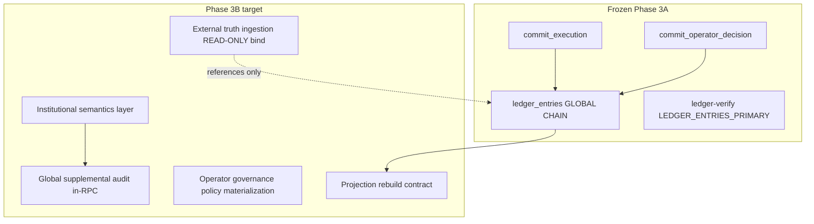
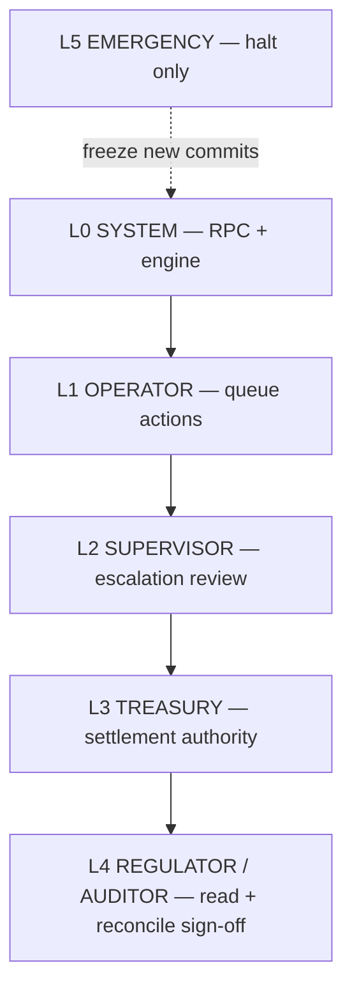

# EXECUTIA Phase 3B — Institutional Execution Semantics Plan

**Document class:** Architecture / governance specification (plan only)  
**Prerequisite:** Phase 3A stabilization complete (`b420562`, `3e894e9`, `baabf13`; see `docs/PHASE_3A_STABILIZATION_REPORT.md`)  
**Status:** Approved for planning — **no code, SQL, or implementation**  
**Authority today:** `ledger_entries` global chain (`authority_mode: LEDGER_ENTRIES_PRIMARY`)

---

## 1. Purpose and scope

Phase 3B defines **what execution means institutionally** after Phase 3A made `ledger_entries` the sole material execution truth. It answers:

- How lifecycle terms (APPROVED → COMMITTED → settlement) map to **approved statuses** without polluting the hash authority model.
- How **external systems** (banks, ERPs, regulators, agents) attach proof without becoming shadow writers.
- How **operators** escalate, quorum-approve, override, and halt without breaking RPC atomicity.
- How **projections** (`execution_results`) stay derived, repairable, and replay-safe.
- What **rollback** means when the ledger is append-only.
- How **AI orchestration** submits work through the same governance gate as humans.

Phase 3B is **not** a UI rebuild, public proof redesign, or operator terminal semantics change (Phase 2 lock).

---

## 2. Current state (post–Phase 3A)

| Layer | State |
|-------|--------|
| Material truth | `ledger_entries` + `executia_ledger_append` / `executia_ledger_entry_hash` |
| Projection | `execution_results` (may drift; legacy isolated via warnings) |
| Verify surface | `verified` = `ledger_chain`; legacy chains visible + `legacy_*_warning` |
| Settlement | `core_ledger` separate chain; legacy formula drift possible |
| Audit | Supplemental rows; RPC audit not yet global hashed chain |
| Approved `status` enum | `APPROVED`, `BLOCKED`, `PENDING_REVIEW`, `COMMITTED`, `FAILED` only |



---

## 3. Institutional status semantics

### 3.1 Governance rule (non-negotiable)

**`execution_results.status` and material `ledger_entries.status` for execution lifecycle may only use the five approved values:**

`APPROVED` · `BLOCKED` · `PENDING_REVIEW` · `COMMITTED` · `FAILED`

Terms such as **EXECUTED**, **SETTLED**, **REVERSED**, and **RECONCILIATION_REQUIRED** are **institutional semantics** — expressed via companion fields and audit types, not new primary status enum values (unless a future governance amendment explicitly extends the enum).

### 3.2 Semantic dictionary

| Term | Institutional meaning | Maps to approved `status` | Material ledger append? | Typical companion fields / events |
|------|----------------------|----------------------------|-------------------------|-----------------------------------|
| **APPROVED** | Policy and operator authority allow execution to proceed; not yet externally executed or ledger-finalized for commit. | `APPROVED` | Yes — operator/submit RPC link | `decision: APPROVE`; `OPERATOR_DECISION_RECORDED` |
| **EXECUTED** | External provider confirms the action occurred in the real world (payment sent, contract signed, infrastructure provisioned). | Stays `APPROVED` or moves to `COMMITTED` per policy | Optional append: `EXECUTION_EXTERNALLY_CONFIRMED` audit only until commit policy fires | `external_execution_id`, `provider_confirmation_at`, payload.`lifecycle_phase: EXECUTED` |
| **SETTLED** | Funds / obligation cleared in accounts; **settlement plane** truth. | `COMMITTED` (execution) + `core_ledger.settlement_status: SETTLED` | `core_ledger` append / update (settlement chain); **not** a substitute for ledger execution hash | `SETTLEMENT_RECONCILED` (proof registry); settlement timestamps |
| **COMMITTED** | Institution records execution as finalized on the material ledger: immutable institutional commitment to the execution fact. | `COMMITTED` | **Yes** — required `commit_*` RPC or future `commit_approved_execution` | `EXECUTION_COMMITTED`; ledger link with `status: COMMITTED`, `decision: APPROVE` |
| **FAILED** | Execution could not complete (technical, policy hard-fail, or provider reject). Terminal. | `FAILED` | Yes — append with `BLOCK` or dedicated fail policy | `EXECUTION_FAILED`; reason codes |
| **REVERSED** | A prior committed fact is negated institutionally via **compensating execution**, not by mutating history. | New execution or compensating row; original stays `COMMITTED` | **New append** only (never UPDATE old `entry_hash`) | `EXECUTION_REVERSED_COMPENSATING`; links `reverses_execution_id` |
| **RECONCILIATION_REQUIRED** | Internal books / external proof / settlement disagree; execution frozen for operators until reconciled. | `APPROVED` or `COMMITTED` (frozen) | No status promotion until cleared | `reconciliation_state: REQUIRED`; `RECONCILIATION_VERIFY` audit |

### 3.3 Lifecycle (happy path)

```text
REQUEST → VALIDATION → DECISION → [PENDING_REVIEW] → APPROVED → (EXECUTED external) → COMMITTED → (SETTLED settlement)
```

| Transition | Writer | Atomic boundary |
|------------|--------|-----------------|
| → `PENDING_REVIEW` | `commit_execution` | RPC |
| → `APPROVED` / `BLOCKED` | `commit_operator_decision` | RPC |
| → `COMMITTED` | `commit_approved_execution` (planned) or governed commit path | RPC (Phase 3B/C — not retroactive shadow JS) |
| → SETTLED | Settlement service on `core_ledger` | Separate chain; references `execution_id` |

### 3.4 COMMITTED vs APPROVED (institutional distinction)

| Dimension | APPROVED | COMMITTED |
|-----------|----------|-----------|
| Meaning | Authorized to execute | Institutionally recorded as executed and ledger-final |
| Material ledger | May have APPROVED link from operator | Must have COMMITTED link (append) |
| Reversible | Yes — block / reject before commit | **No** — only compensating execution |
| Public proof eligibility | Operator approval events | Truth anchor / commit proof layers |
| External proof | Optional pre-commit confirmations | Required post-commit reconciliation per policy tier |

**Phase 3B does not** collapse APPROVED and COMMITTED into one state.

### 3.5 FAILED semantics

- Terminal for the **execution fact** (not retry-in-place on same `execution_id` hash chain).
- Retry = **new** `execution_id` with reference `supersedes_execution_id` in payload/audit.
- FAILED material append uses `decision: BLOCK` or explicit fail decision policy; reason mandatory in RPC payload.

### 3.6 REVERSED semantics (compensating model)

- **Irreversible ledger history:** prior `entry_hash` rows remain.
- **Reversal** = new governed request → new `execution_id` OR explicit compensating append on same org scope with `event: REVERSAL` in ledger payload (policy chooses; default **new execution** for clarity).
- Original row `status` stays `COMMITTED`; proof chain records `REVERSAL_OF` reference.

### 3.7 RECONCILIATION_REQUIRED semantics

- **Not** a sixth status — use `execution_results.reconciliation_state` (existing pattern) + audit.
- Blocks promotion to SETTLED and may block COMMITTED if policy requires pre-commit reconciliation.
- Authority: reconciliation service + auditor role; operators cannot self-clear without permission (`governance.review` / `audit` JWT scopes).

---

## 4. External execution truth

### 4.1 Principles

| Principle | Rule |
|-----------|------|
| External systems never write `ledger_entries` | Ingestion → validation → RPC only |
| External proof is supplemental | Binds to `execution_id`; does not override material hash |
| Single ingestion authority | Central service; no ad-hoc endpoint inserts |
| Deterministic normalization | Provider payloads → canonical `external_confirmation` v1 |

### 4.2 Provider confirmations

| Concept | Definition |
|---------|------------|
| **Provider** | External system of record (bank, ERP, government registry, cloud API). |
| **Confirmation** | Signed or API-verifiable attestation that action `{type, amount, reference}` occurred. |
| **Binding** | Stored as audit + optional `execution_results.payload.external_confirmations[]` summary; hash of normalized confirmation in audit payload. |

**Flow:**

```text
Provider webhook/API → ingest/confirm → validate schema + org scope
  → writeAuditEvent(EXTERNAL_PROVIDER_CONFIRMED)  [Phase 3B: global chain]
  → optional: trigger EXECUTED semantic flag (no automatic COMMITTED)
```

### 4.3 Execution tickets

| Field | Purpose |
|-------|---------|
| `ticket_id` | External workflow id (ServiceNow, Jira, internal ticket). |
| `ticket_type` | `CHANGE`, `PAYMENT`, `PROCUREMENT`, etc. |
| `ticket_status` | External only — never copied to `execution_results.status` |

Tickets are **correlation**, not truth.

### 4.4 Settlement verification

| Plane | Authority |
|-------|-----------|
| Execution material | `ledger_entries` |
| Settlement material | `core_ledger` + `settlement_status` |
| Verification API | `core-ledger-verify`, account audit in `ledger-verify` |

**SETTLED** is proven on settlement plane, not by flipping execution `status` alone.

### 4.5 Reconciliation authority

| Role | Power |
|------|-------|
| `EXECUTIA_RECONCILIATION_LAYER` (system) | Auto-verify when hashes align |
| Auditor / `governance.review` | Manual clear of `RECONCILIATION_REQUIRED` |
| Operator | May **flag** mismatch; cannot clear without scope |

Reconciliation outcomes: `reconciliation_state: VERIFIED | REQUIRED | FAILED` on projection only; materialized in audit + optional projection columns.

### 4.6 External proof ingestion

| Source | Destination |
|--------|-------------|
| Regulator package | Public proof registry (frozen schema Phase 3B) |
| Operator upload | Validation → audit event |
| Provider API | `api/v1/.../ingest` (new Phase 3B route) → service only |

**Ingestion contract:** `external_proof` record references `execution_id`, `ledger_entry_hash` (read from latest head), never supplies alternate hash.

---

## 5. Operator governance model

### 5.1 Layers



### 5.2 Escalation layers

| Layer | Trigger | Action |
|-------|---------|--------|
| L1 | `PENDING_REVIEW` | APPROVE / BLOCK / FREEZE (FREEZE stays `PENDING_REVIEW`) |
| L2 | HIGH risk, amount threshold, policy `requires_supervisor` | ESCALATE → supervisor queue |
| L3 | COMMITTED + settlement controls | Treasury release |
| L4 | RECONCILIATION_REQUIRED | Auditor sign-off |

Escalation produces **audit events only** until terminal decision RPC fires.

### 5.3 Multi-sign approval

| Concept | Semantics |
|---------|-----------|
| **Quorum** | `required_approvals: N`, `collected_approvals: [{operator_id, at, signature_ref}]` |
| **Materialization** | `commit_operator_decision` or new `commit_quorum_approval` RPC fires only when `N` reached |
| **Partial approvals** | Supplemental audit `OPERATOR_APPROVAL_COLLECTED`; no ledger status change |

Multi-sign does not bypass `PENDING_REVIEW` → `APPROVED` RPC.

### 5.4 Operator override rules

| Override type | Allowed | Material effect |
|---------------|---------|-----------------|
| Policy BLOCK → REVIEW escalate | Yes | Audit only until RPC |
| Force BLOCK with reason | Yes | `commit_operator_decision(BLOCK)` |
| Force APPROVE with supervisor co-sign | Yes | Quorum RPC |
| Rewrite ledger history | **No** | — |
| Set COMMITTED without RPC | **No** | — |
| Skip external confirmation when policy requires | **No** | — |

Overrides are **additional audit + RPC**, never direct table UPDATE of `status`/`hash`.

### 5.5 Quorum semantics

- Quorum state stored in `governance_reviews` / payload (existing V2 direction) or dedicated `execution_quorum` table (Phase 3B design option — **no schema in this plan document**).
- Quorum **expires** (TTL); expiry returns execution to `PENDING_REVIEW` via audit, not silent timeout.
- One operator cannot count twice.

### 5.6 Emergency halt authority

| Authority | Scope |
|-----------|-------|
| `SYSTEM_ADMIN` / internal key | `EXECUTIA_GLOBAL_HALT=true` env + `system_halt` row |
| Effect | New `commit_execution` / `commit_operator_decision` → `BLOCK` or HTTP 503 with `EXECUTION_HALTED` |
| In-flight RPC | Completes; halt applies to **new** commits |
| Lift | Dual-control audit `HALT_LIFTED` |

Halt does not mutate existing ledger rows.

---

## 6. Projection architecture

### 6.1 `execution_results` role

| Property | Rule |
|----------|------|
| Role | **Read-optimized projection** of latest material ledger head + policy-enriched metadata |
| Not authoritative | `ledger-verify` uses `ledger_chain` for `verified` |
| Writable columns | Non-hash metadata, org scope, reconciliation, operator fields |
| Hash columns | **Derived** from latest `ledger_entries` for that `execution_id` |

### 6.2 Projection rebuild rules

| Rule | Description |
|------|-------------|
| **Source of truth** | Latest `ledger_entries` row per `execution_id` (by `created_at DESC`) |
| **Rebuild formula** | `hash` ← `entry_hash`, `prev_hash` ← `previous_hash`, `status` ← ledger `status`, `decision` ← inferred per `ledger.js` rules |
| **When** | After legacy repair; after RPC; optional nightly `projection_reconcile` job |
| **Never** | Rebuild ledger from projection |

### 6.3 Materialized views vs canonical chain

| Approach | Phase 3B stance |
|----------|-----------------|
| **Canonical chain** | `ledger_entries` (required) |
| **Projection table** | `execution_results` (current) |
| **Optional MV** | `execution_latest_material` (read-only view: `DISTINCT ON (execution_id)` from ledger) — recommended for consoles; **not** a second writer |

MVs must not accept INSERT; they reflect ledger only.

### 6.4 Replay safety

| Operation | Safe | Notes |
|-----------|------|-------|
| Re-read ledger chronologically | Yes | Rebuild verify |
| Re-apply `buildLedgerHash` to entries | Yes | Parity check |
| Replay RPC on same id | **No** | New ids only |
| DELETE ledger row | **No** | Breaks global chain |
| Projection rebuild from ledger | Yes | Idempotent per head |

**Replay audit:** Global supplemental chain can be rebuilt only via controlled repair job (Phase 3B.2), not in live hot path.

---

## 7. Rollback boundaries

### 7.1 Reversible vs irreversible

| Action | Class | Mechanism |
|--------|-------|-----------|
| PENDING_REVIEW → BLOCKED | Reversible institutionally | New execution if business allows |
| APPROVED (not committed) | Reversible | BLOCK via operator RPC |
| COMMITTED | **Irreversible** | Compensating execution only |
| ledger append | **Irreversible** | Compensating append |
| Audit supplemental (Phase 3B) | Append-only | Compensating audit with `correction_of` |
| SETTLED | Reversible only via settlement reversal entry | `core_ledger` compensating row |

### 7.2 Chain append guarantees

| Guarantee | Enforced by |
|-----------|-------------|
| Global order | `created_at` + monotonic `entry_hash` chain |
| Concurrency | `pg_advisory_xact_lock(hashtext('executia_ledger'))` |
| Atomicity | Single RPC transaction: ledger + projection + audit (Phase 3B) |
| No UPDATE on `entry_hash` | Governance + DB trigger (optional Phase 3B.3) |

### 7.3 Compensating execution model

```text
Original: execution_id=A, status=COMMITTED
Reversal: execution_id=B, payload.reverses=A, ledger append status=BLOCKED or COMMITTED with payload.event=REVERSAL
```

Net institutional effect recorded in audit + registry; **both** hashes remain in global chain.

### 7.4 Application rollback (deploy)

| Rollback type | Scope |
|---------------|-------|
| SQL `011` rollback | RPC function bodies only — does not undo ledger rows |
| App deploy revert | Verify semantics, audit format |
| Data rollback | **Forbidden** except forensic restore from backup |

---

## 8. AI orchestration compatibility

### 8.1 Agent execution requests

| Requirement | Design |
|-------------|--------|
| Agents are actors | `actor: agent:{agent_id}` in payload |
| Same pipeline | `submit` → `commit_execution` (canonical evaluation) |
| No privileged bypass | Agents use API keys with scoped JWT; no service-role in agent runtime |
| Idempotency | `client_request_id` in payload; RPC dedupe (Phase 3B.4) |

### 8.2 Governance validation layer

```text
Agent request → schema validation → policy materialization → evaluateRules
  → canonical_evaluation v1 → commit_execution RPC
```

Agents cannot call `commit_operator_decision` without operator scope unless explicit `agent_operator_delegate` policy (off by default).

### 8.3 Deterministic execution constraints

| Constraint | Rule |
|------------|------|
| Same input payload | Same canonical_evaluation (Phase 1) |
| No non-deterministic fields in hash input | `evaluated_at` excluded from ledger hash (already) |
| Model version in audit only | `payload.agent.model` supplemental |
| Temperature / randomness | Not in material payload |

### 8.4 Repo-less orchestration compatibility

| Pattern | Support |
|---------|---------|
| HTTP-only agents | `POST /api/v1/submit`, poll `GET /api/v1/history` |
| Webhook callbacks | `WEBHOOK_CALLBACK_SECRET`; no git clone required |
| MCP / external orchestrators | Thin client; all truth from API responses including `ledger_entry_hash` |
| No filesystem proof | Proof via API + registry URLs |

Orchestrators must treat `ledger_entries` head hash as the execution receipt fingerprint.

---

## 9. Phase 3B — what changes vs frozen

### 9.1 Phase 3B MAY modify

| Area | Deliverable |
|------|-------------|
| **Global supplemental audit** | `executia_append_global_audit_event`; in-RPC hashed audit; remove material duplicate audit from 009/010 |
| **`audit.js`** | Global `getLastAuditHash()`; `writeAuditEvent` chain only supplemental |
| **Semantics documentation** | Lifecycle mapping, external ingest API contract |
| **Ingestion routes** | New read-only/bind endpoints under `api/v1/` (external confirm) — no ledger direct write |
| **Governance materialization** | Quorum + escalation audit types via centralized notifications |
| **Projection rebuild** | Job or admin endpoint `POST /api/v1/projection/rebuild` (internal key) — updates projection from ledger |
| **`commit_approved_execution` RPC** | APPROVED → COMMITTED on material ledger (replaces shadow `commit-execution` writes) — **Phase 3B.5 or 3C** (explicit sub-milestone) |
| **Verify docs** | Clarify `legacy_verified` vs semantics (no regression) |

### 9.2 Phase 3B MUST NOT modify

| Forbidden | Reason |
|-----------|--------|
| `executia_ledger_entry_hash` formula | Phase 3A frozen |
| `ledger_entries` authority model | Phase 3A frozen |
| Operator terminal RPC semantics (APPROVE/BLOCK) | Phase 2 lock |
| Public proof registry schema / event taxonomy | Compatibility |
| UI / console HTML | Out of scope |
| Five-status enum expansion | Governance amendment required |
| `authority_mode` regression | Must stay `LEDGER_ENTRIES_PRIMARY` |
| Per-execution audit chains | Architecture decision |

### 9.3 Frozen from Phase 3A (carry-forward)

| Item | Status |
|------|--------|
| `LEDGER_HASH_FORMULA_ID` / `executia/ledger/v1` | Frozen |
| `commit_execution` / `commit_operator_decision` ledger append path | Frozen (audit portion may change) |
| `ledger-verify` primary `verified` | Frozen |
| Phase 1 canonical evaluator | Frozen |
| Phase 2 operator RPC-only terminal transitions | Frozen |

---

## 10. Phase subdivision (recommended sequencing)

| Sub-phase | Focus | Depends on |
|-----------|-------|------------|
| **3B.1** | Global audit SQL + RPC integration (supplemental only) | 3A SQL deployed |
| **3B.2** | `audit.js` global chain; retire raw route inserts to `writeAuditEvent` | 3B.1 |
| **3B.3** | Institutional semantics in API responses (`lifecycle_phase`, `reconciliation_state` docs) | — |
| **3B.4** | External confirmation ingest (no ledger write) | 3B.2 |
| **3B.5** | Projection rebuild contract + optional job | 3A |
| **3B.6** | `commit_approved_execution` RPC (COMMITTED semantics) | 3B.1; may slip to **3C** if scope guard triggers |
| **3B.7** | Quorum / escalation governance (audit-first) | 3B.2 |
| **3B.8** | Legacy audit backfill policy (optional, off-hours) | 3B.1 |

**Phase 3C (boundary):** `commit-execution` retirement, `core_ledger` formula repair convergence, settlement plane authority doc.

---

## 11. Migration sequencing (no SQL in this plan)

| Order | Activity | Risk |
|-------|----------|------|
| 1 | Publish semantics dictionary (this document) | Low |
| 2 | Deploy 3B.1 audit functions + RPC branch | Med |
| 3 | Deploy 3B.2 app audit callers | Med |
| 4 | Run projection rebuild (3A.2 ops) before tightening verify | Med |
| 5 | Enable external ingest read-only | Low |
| 6 | Introduce COMMITTED RPC (3B.6/3C) | High |
| 7 | Quorum governance | Med |

**No migration** may rewrite historical `ledger_entries.entry_hash`.

---

## 12. Risk analysis

| ID | Risk | L | I | Mitigation |
|----|------|---|---|------------|
| B1 | Operators confuse EXECUTED vs COMMITTED | M | H | Dictionary + API `lifecycle_phase` |
| B2 | External ingest writes shadow truth | M | H | Single ingest service; reviews |
| B3 | Global audit backfill breaks verify | M | H | `chain_era` cutoff; repair job |
| B4 | COMMITTED RPC doubles ledger append | L | M | Idempotency guard |
| B5 | Quorum deadlock | M | M | TTL + escalate |
| B6 | Emergency halt forgotten on | L | H | Dual-control lift |
| B7 | AI agent over-permissioned | M | H | Default deny operator RPC |
| B8 | Projection rebuild overwrites business metadata | M | M | Rebuild hash/status/decision only |
| B9 | Settlement SETTLED confused with COMMITTED | M | H | Separate plane docs |
| B10 | Phase 3B scope creep into proof UI | H | M | Phase gate reviews |

---

## 13. Acceptance criteria (Phase 3B complete)

| Criterion | Measure |
|-----------|---------|
| Global audit chain | `verifyAuditChain()` global pass for post-cutoff rows |
| RPC atomicity | Ledger + projection + audit same transaction |
| Material authority unchanged | `ledger_chain` parity vectors still pass |
| Semantics documented | All §3 terms mapped to five statuses |
| External ingest | No `ledger_entries` INSERT outside RPC |
| Operator behavior | Phase 2 smoke unchanged |
| Public proof | Existing exports unchanged structurally |
| Verify surface | `authority_mode` remains `LEDGER_ENTRIES_PRIMARY` |

---

## 14. Document control

| Field | Value |
|-------|-------|
| Title | Phase 3B Institutional Execution Semantics Plan |
| Version | 1.0 (plan only) |
| Implementation | **None** |
| SQL | **None** |
| Prerequisite report | `docs/PHASE_3A_STABILIZATION_REPORT.md` |

---

*Phase 3B defines institutional language and boundaries; Phase 3A defines material hash truth. Implementation requires explicit approval per sub-phase (3B.1–3B.8).*
